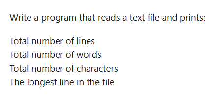

# Week 1 - Question 1: File Word, Line & Character Statistics

## Problem Statement
Write a program that reads a text file and prints:
- Total number of lines
- Total number of words
- Total number of characters
- The longest line in the file



---

## Solution Code (`q1.cpp`)

```cpp
#include <bits/stdc++.h>
using namespace std;

int main() {
    string filename;
    cout << "enter file name:- ";
    cin >> filename;
    
    ifstream file(filename);
    
    if (!file) {
        cout << "file not found" << endl;
        return 1;
    }
    string line; 
    int totalline = 0, totalwords = 0, totalchars = 0;
    string longestline;
    
    while (getline(file, line)) {
        totalline++;
        totalchars += line.length();
        stringstream ss(line);
        string word;
        while (ss >> word) totalwords++;
        if (line.length() > longestline.length()) longestline = line;
    }
    file.close();
    
    cout << "total number of lines:- " << totalline << endl;
    cout << "total number of words:- " << totalwords << endl;
    cout << "total number of characters:- " << totalchars << endl;
    cout << "longest line:- " << longestline << endl;
    return 0;
}
```

---

## How to Compile & Run
```bash
g++ q1.cpp -o q1
./q1
```
